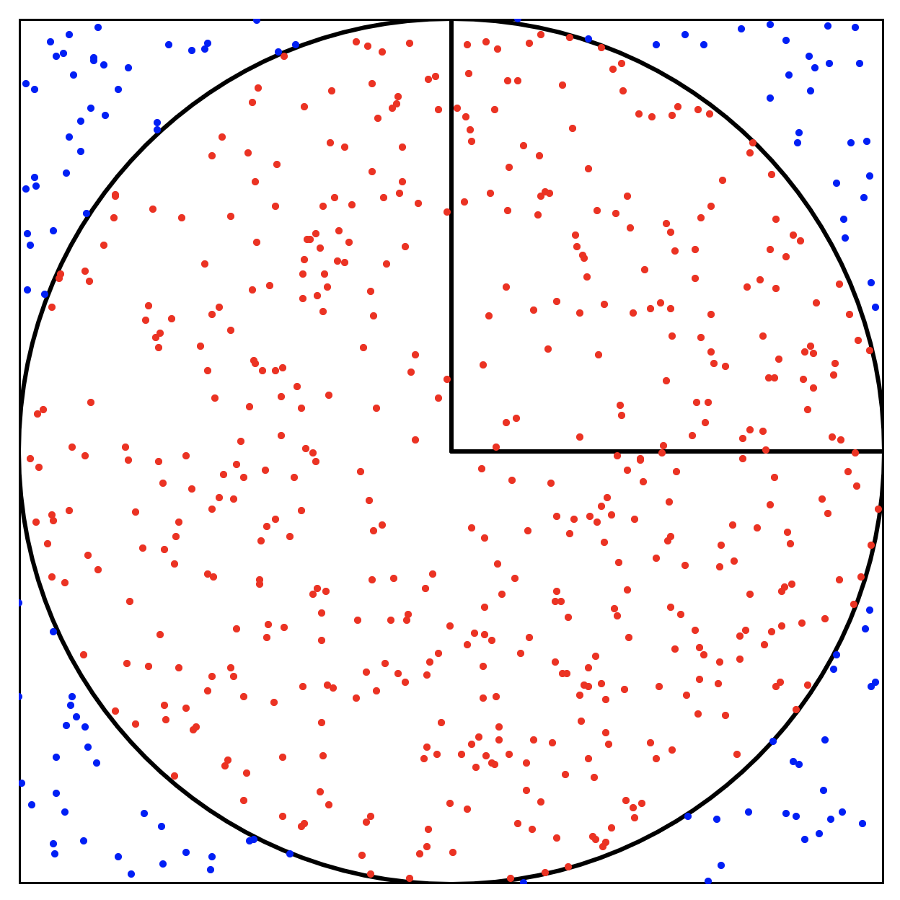

# PI ESTIMATION (Visualization) with P5.JS

## Preview
<!--  -->


See the live preview with the [p5.js Web Editor](https://editor.p5js.org/jac237/sketches/3tiMjKd3U)!

## Background
The image above describes a **unit circle**, a circle with radius 1, enclosed by a **square** with unit length 2.

We know from alegbra that the **area of a circle** can be found using the equation:

$$ \pi \times r ^ 2$$

Since the unit circle has radius 1, the area of the unit circle is $\pi$. The area of the enclosing square is 4. This computation gives us a **ratio**:

$$\frac{\text{area of circle}}{\text{area of square}} = \frac{\pi}{4}$$

From the equation above, we can derive the following:

$$\frac{\text{ratio of circle}}{\text{ratio of square}} \times 4 = \pi$$

We can interpret this information as the **ratio** of **red dots** (inside the circle) to the **total number of dots** (red + blue dots) *multiplied* by 4.

$$\frac{\text{\# of red dots}}{\text{total \# of dots}} \times 4 = \pi$$

## Sample Console Output

```javascript
3.2
3.3333333333333335
3.4285714285714284
3.5
3.5555555555555554
3.6
....
3.1384615384615384
3.1406649616368285
3.142857142857143
3.145038167938931
```

## License
[MIT License](./LICENSE.md)
